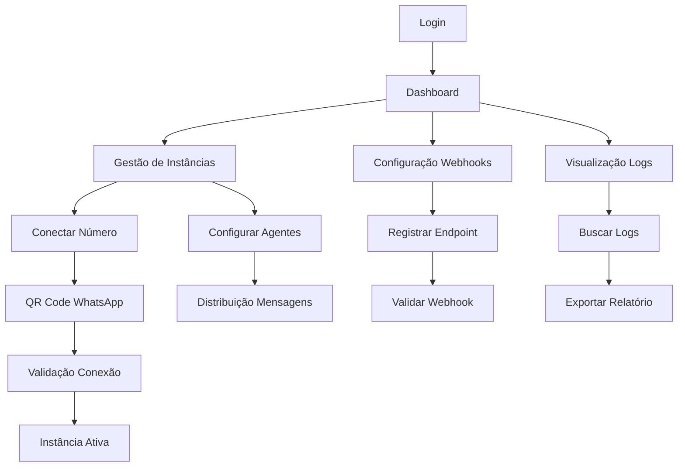

## 1. Visão Geral do Produto
Sistema de API de WhatsApp empresarial multi-tenant que permite conectar números de telefone a agentes automatizados com distribuição inteligente de mensagens.
- Resolve a necessidade de empresas gerenciarem múltiplos números WhatsApp com automação e webhooks
- Permite integração com sistemas de atendimento, chatbots e CRMs
- Target: empresas de médio/grande porte que precisam de gestão centralizada de WhatsApp

## 2. Funcionalidades Principais

### 2.1 Papéis de Usuário
| Papel | Método de Registro | Permissões Principais |
|-------|-------------------|----------------------|
| Administrador | Convite/Registro direto | Acesso total, gestão de tenants, configuração global |
| Tenant Manager | Registro via admin | Gestão de instâncias, webhooks, relatórios |
| Developer | Registro via tenant | Acesso à API, configuração de webhooks, logs |
| Viewer | Convite do tenant | Visualização de dashboards e relatórios |

### 2.2 Módulos de Funcionalidades
O sistema de API de WhatsApp consiste nos seguintes módulos principais:
1. **Painel de Controle**: dashboard, gestão de instâncias, monitoramento em tempo real
2. **Gestão de Instâncias**: conexão de números, configuração de agentes, status de conexão
3. **Distribuição de Mensagens**: filas, roteamento inteligente, balanceamento de carga
4. **Configuração de Webhooks**: endpoints, eventos, validação, retry automático
5. **Logs e Auditoria**: registros detalhados, busca avançada, exportação

### 2.3 Detalhamento das Funcionalidades
| Nome do Módulo | Componente | Descrição da Funcionalidade |
|----------------|------------|------------------------------|
| Painel de Controle | Dashboard | Visualizar status de todas as instâncias, métricas de mensagens, erros em tempo real |
| Painel de Controle | Monitoramento | Alertas de falhas, tempo de resposta, taxa de entrega |
| Gestão de Instâncias | Conexão WhatsApp | Conectar número via WhatsApp Business API, gerenciar QR Code, validar credenciais |
| Gestão de Instâncias | Agentes | Criar/editar agentes automatizados, definir regras de resposta, configurar horários |
| Distribuição de Mensagens | Filas | Implementar sistema de filas com Redis/BullMQ, priorização de mensagens |
| Distribuição de Mensagens | Roteamento | Distribuir mensagens entre agentes baseado em regras, carga de trabalho, habilidades |
| Webhooks | Configuração | Cadastrar endpoints, validar URLs, configurar tipos de eventos desejados |
| Webhooks | Eventos | Disparar webhooks para mensagens recebidas, status de entrega, falhas de conexão |
| Logs | Auditoria | Registrar todas as operações com timestamp, IP, usuário, dados da requisição/resposta |
| Logs | Busca | Permitir busca por número, data, tipo de evento, status, conteúdo da mensagem |
| Autenticação | JWT | Implementar autenticação segura com tokens JWT, refresh tokens, validação de sessão |
| Autenticação | Multi-tenant | Isolamento de dados por tenant, permissões granulares, rate limiting por tenant |

## 3. Fluxos Principais

### Fluxo de Configuração de Nova Instância
1. Tenant Manager acessa painel de gestão de instâncias
2. Clica em "Nova Instância" e insere número de telefone
3. Sistema gera QR Code para conexão WhatsApp Business
4. Usuário escaneia QR Code no aplicativo WhatsApp
5. Sistema valida conexão e ativa instância
6. Configura agentes e webhooks associados

### Fluxo de Recebimento e Distribuição de Mensagens
1. Mensagem recebida via WhatsApp Business API
2. Sistema valida autenticidade e integridade
3. Mensagem é enfileirada no Redis com metadados
4. Sistema de distribuição identifica agente disponível
5. Mensagem é roteada para agente selecionado
6. Webhook é disparado para URL configurada
7. Resposta do agente é enviada via WhatsApp
8. Status de entrega é registrado e webhook disparado

### Fluxo de Auditoria e Logs
1. Toda operação é registrada com contexto completo
2. Logs são indexados para busca eficiente
3. Administrador pode buscar por múltiplos critérios
4. Sistema permite exportação de relatórios
5. Alertas são disparados para anomalias detectadas

## 4. Design da Interface

### 4.1 Estilo de Design
- **Cores Primárias**: Verde WhatsApp (#25D366), azul tecnologia (#0078D4)
- **Cores Secundárias**: Cinza claro (#F5F5F5), branco (#FFFFFF)
- **Estilo de Botões**: Arredondados com sombra suave, hover effects
- **Tipografia**: Inter para textos, Roboto Mono para código/logs
- **Tamanhos de Fonte**: 14px corpo, 16px headers, 12px detalhes
- **Layout**: Card-based com navegação lateral, dashboard grid responsivo
- **Ícones**: Material Design Icons, consistência com WhatsApp

### 4.2 Visão Geral das Páginas
| Página | Módulo | Elementos de UI |
|--------|--------|-----------------|
| Dashboard | Métricas | Cards com KPIs, gráficos de linha para volume de mensagens, status com indicadores coloridos |
| Instâncias | Lista | Tabela com status online/offline, última atividade, ações rápidas, paginação |
| Instâncias | Conexão | Modal com QR Code centralizado, botão de refresh, instruções passo-a-passo |
| Agentes | Configuração | Form com regras de roteamento, teste de expressões, preview de respostas |
| Webhooks | Gerenciamento | Lista de endpoints, status de saúde, última chamada, toggle ativação |
| Logs | Busca | Filtros avançados, timeline visual, exportação CSV/JSON, busca em tempo real |

### 4.3 Responsividade
- **Desktop-first**: Otimizado para telas grandes (1920x1080)
- **Mobile-adaptive**: Layout adaptável para tablets e smartphones
- **Breakpoints**: 1200px, 768px, 480px
- **Touch optimization**: Botões maiores em mobile, gestos de swipe

### 4.4 Elementos de Status e Feedback
- **Notificações**: Toast messages para ações do usuário
- **Loading States**: Skeleton screens para carregamento de dados
- **Estados de Erro**: Mensagens claras com sugestões de ação
- **Confirmações**: Modais para ações destrutivas
- **Progress Indicators**: Barras de progresso para operações longas