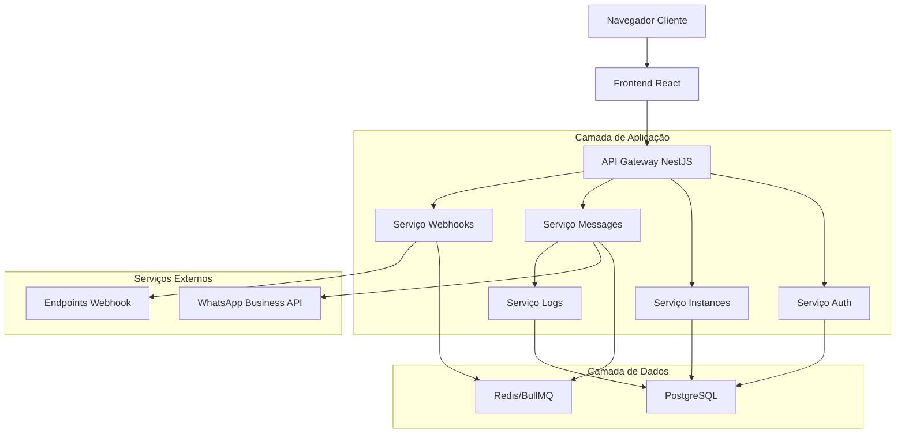
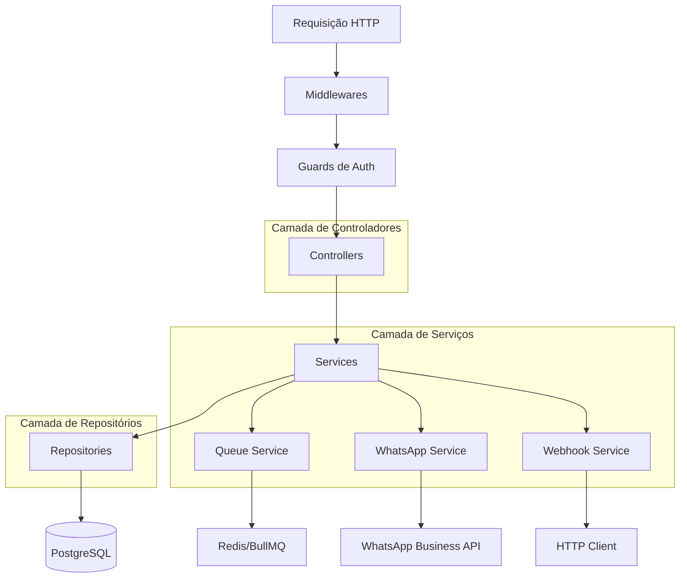
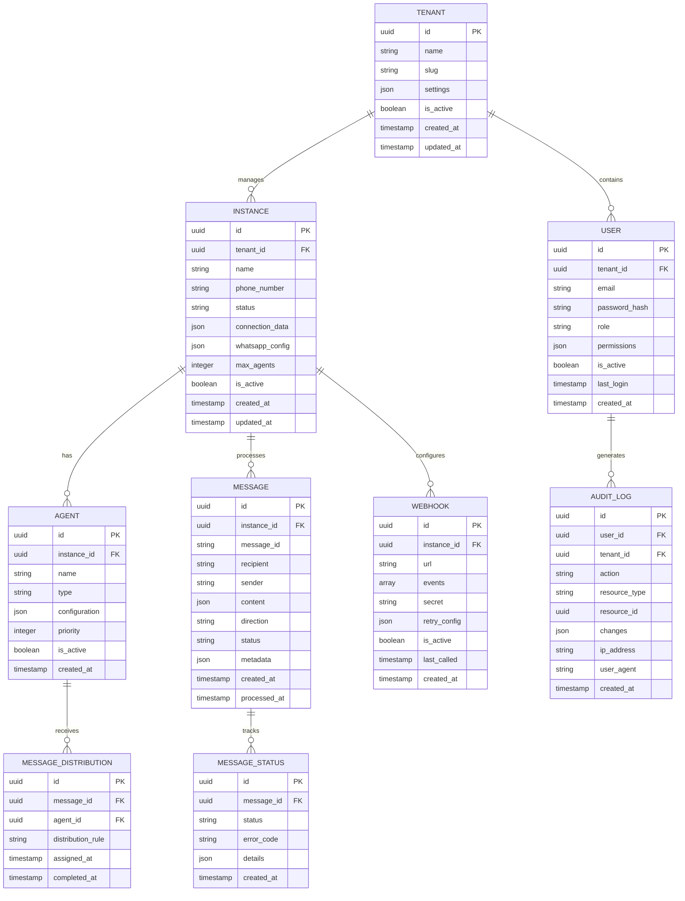

## 1. Arquitetura do Sistema



## 2. Descrição das Tecnologias

- **Backend**: Node.js@18 + NestJS@10 + TypeScript@5
- **Banco de Dados**: PostgreSQL@15 + Prisma@5 (ORM)
- **Cache/Filas**: Redis@7 + BullMQ@4
- **Autenticação**: JWT + Passport + bcrypt
- **Validação**: class-validator + class-transformer
- **Documentação**: Swagger/OpenAPI 3.0
- **Testes**: Jest + Supertest + TestContainers
- **Logs**: Winston + Pino
- **Monitoramento**: Prometheus + Grafana

## 3. Definições de Rotas

| Rota | Método | Descrição |
|------|--------|-----------|
| /auth/login | POST | Autenticação de usuário |
| /auth/refresh | POST | Renovação de token JWT |
| /auth/logout | POST | Encerramento de sessão |
| /instances | GET | Listar instâncias do tenant |
| /instances | POST | Criar nova instância |
| /instances/:id | GET | Detalhes da instância |
| /instances/:id/connect | POST | Conectar ao WhatsApp |
| /instances/:id/disconnect | POST | Desconectar do WhatsApp |
| /instances/:id/qr | GET | Obter QR Code para conexão |
| /instances/:id/status | GET | Status da conexão |
| /agents | GET | Listar agentes da instância |
| /agents | POST | Criar novo agente |
| /agents/:id | PUT | Atualizar agente |
| /agents/:id | DELETE | Remover agente |
| /messages/send | POST | Enviar mensagem |
| /messages/:id | GET | Status da mensagem |
| /messages/history | GET | Histórico de mensagens |
| /webhooks | GET | Listar webhooks configurados |
| /webhooks | POST | Registrar novo webhook |
| /webhooks/:id | PUT | Atualizar webhook |
| /webhooks/:id | DELETE | Remover webhook |
| /webhooks/:id/test | POST | Testar webhook |
| /logs | GET | Buscar logs com filtros |
| /logs/export | GET | Exportar logs |
| /metrics | GET | Métricas do sistema |

## 4. Definições de API

### 4.1 Autenticação

**Login de Usuário**
```
POST /auth/login
```

Request:
| Parâmetro | Tipo | Obrigatório | Descrição |
|-----------|------|-------------|-----------|
| email | string | sim | Email do usuário |
| password | string | sim | Senha (mínimo 8 caracteres) |
| tenantId | string | sim | ID do tenant |

Response:
```json
{
  "access_token": "eyJhbGc...",
  "refresh_token": "eyJhbGc...",
  "user": {
    "id": "uuid",
    "email": "user@example.com",
    "role": "tenant_manager",
    "tenantId": "uuid"
  },
  "expires_in": 3600
}
```

### 4.2 Gestão de Instâncias

**Criar Instância**
```
POST /instances
```

Request:
| Parâmetro | Tipo | Obrigatório | Descrição |
|-----------|------|-------------|-----------|
| name | string | sim | Nome da instância |
| phoneNumber | string | sim | Número de telefone (formato E164) |
| description | string | não | Descrição da instância |
| maxAgents | number | não | Máximo de agentes (default: 10) |

Response:
```json
{
  "id": "uuid",
  "name": "Atendimento Vendas",
  "phoneNumber": "+5511999999999",
  "status": "disconnected",
  "qrCode": null,
  "createdAt": "2024-01-01T00:00:00Z"
}
```

### 4.3 Envio de Mensagens

**Enviar Mensagem**
```
POST /messages/send
```

Request:
| Parâmetro | Tipo | Obrigatório | Descrição |
|-----------|------|-------------|-----------|
| instanceId | string | sim | ID da instância |
| recipient | string | sim | Número do destinatário |
| message | object | sim | Objeto da mensagem |
| priority | string | não | Prioridade (low, normal, high) |

Message Object:
```json
{
  "type": "text",
  "content": "Olá, como posso ajudar?",
  "options": {
    "delay": 1000,
    "typing": true
  }
}
```

### 4.4 Configuração de Webhooks

**Registrar Webhook**
```
POST /webhooks
```

Request:
| Parâmetro | Tipo | Obrigatório | Descrição |
|-----------|------|-------------|-----------|
| instanceId | string | sim | ID da instância |
| url | string | sim | URL do endpoint |
| events | array | sim | Tipos de eventos |
| secret | string | não | Secret para validação |
| retryConfig | object | não | Config de retry |

## 5. Arquitetura do Servidor



## 6. Modelo de Dados

### 6.1 Definição do Modelo



### 6.2 Linguagem de Definição de Dados (DDL)

**Tabela de Tenants**
```sql
-- criar tabela
CREATE TABLE tenants (
    id UUID PRIMARY KEY DEFAULT gen_random_uuid(),
    name VARCHAR(255) NOT NULL,
    slug VARCHAR(100) UNIQUE NOT NULL,
    settings JSONB DEFAULT '{}',
    is_active BOOLEAN DEFAULT true,
    created_at TIMESTAMP WITH TIME ZONE DEFAULT NOW(),
    updated_at TIMESTAMP WITH TIME ZONE DEFAULT NOW()
);

-- criar índices
CREATE INDEX idx_tenants_slug ON tenants(slug);
CREATE INDEX idx_tenants_active ON tenants(is_active);
```

**Tabela de Usuários**
```sql
-- criar tabela
CREATE TABLE users (
    id UUID PRIMARY KEY DEFAULT gen_random_uuid(),
    tenant_id UUID NOT NULL REFERENCES tenants(id) ON DELETE CASCADE,
    email VARCHAR(255) UNIQUE NOT NULL,
    password_hash VARCHAR(255) NOT NULL,
    role VARCHAR(50) NOT NULL CHECK (role IN ('admin', 'tenant_manager', 'developer', 'viewer')),
    permissions JSONB DEFAULT '{}',
    is_active BOOLEAN DEFAULT true,
    last_login TIMESTAMP WITH TIME ZONE,
    created_at TIMESTAMP WITH TIME ZONE DEFAULT NOW(),
    updated_at TIMESTAMP WITH TIME ZONE DEFAULT NOW()
);

-- criar índices
CREATE INDEX idx_users_tenant_id ON users(tenant_id);
CREATE INDEX idx_users_email ON users(email);
CREATE INDEX idx_users_active ON users(is_active);
```

**Tabela de Instâncias**
```sql
-- criar tabela
CREATE TABLE instances (
    id UUID PRIMARY KEY DEFAULT gen_random_uuid(),
    tenant_id UUID NOT NULL REFERENCES tenants(id) ON DELETE CASCADE,
    name VARCHAR(255) NOT NULL,
    phone_number VARCHAR(20) NOT NULL,
    status VARCHAR(50) DEFAULT 'disconnected' CHECK (status IN ('disconnected', 'connecting', 'connected', 'failed')),
    connection_data JSONB DEFAULT '{}',
    whatsapp_config JSONB DEFAULT '{}',
    max_agents INTEGER DEFAULT 10 CHECK (max_agents > 0 AND max_agents <= 100),
    is_active BOOLEAN DEFAULT true,
    created_at TIMESTAMP WITH TIME ZONE DEFAULT NOW(),
    updated_at TIMESTAMP WITH TIME ZONE DEFAULT NOW(),
    UNIQUE(tenant_id, phone_number)
);

-- criar índices
CREATE INDEX idx_instances_tenant_id ON instances(tenant_id);
CREATE INDEX idx_instances_phone ON instances(phone_number);
CREATE INDEX idx_instances_status ON instances(status);
CREATE INDEX idx_instances_active ON instances(is_active);
```

**Tabela de Mensagens**
```sql
-- criar tabela
CREATE TABLE messages (
    id UUID PRIMARY KEY DEFAULT gen_random_uuid(),
    instance_id UUID NOT NULL REFERENCES instances(id) ON DELETE CASCADE,
    message_id VARCHAR(255) UNIQUE,
    recipient VARCHAR(20) NOT NULL,
    sender VARCHAR(20) NOT NULL,
    content JSONB NOT NULL,
    direction VARCHAR(10) NOT NULL CHECK (direction IN ('inbound', 'outbound')),
    status VARCHAR(50) DEFAULT 'pending' CHECK (status IN ('pending', 'sent', 'delivered', 'failed', 'read')),
    metadata JSONB DEFAULT '{}',
    created_at TIMESTAMP WITH TIME ZONE DEFAULT NOW(),
    processed_at TIMESTAMP WITH TIME ZONE,
    updated_at TIMESTAMP WITH TIME ZONE DEFAULT NOW()
);

-- criar índices
CREATE INDEX idx_messages_instance_id ON messages(instance_id);
CREATE INDEX idx_messages_message_id ON messages(message_id);
CREATE INDEX idx_messages_recipient ON messages(recipient);
CREATE INDEX idx_messages_direction ON messages(direction);
CREATE INDEX idx_messages_status ON messages(status);
CREATE INDEX idx_messages_created_at ON messages(created_at DESC);
```

**Tabela de Webhooks**
```sql
-- criar tabela
CREATE TABLE webhooks (
    id UUID PRIMARY KEY DEFAULT gen_random_uuid(),
    instance_id UUID NOT NULL REFERENCES instances(id) ON DELETE CASCADE,
    url VARCHAR(500) NOT NULL,
    events JSONB NOT NULL DEFAULT '[]',
    secret VARCHAR(255),
    retry_config JSONB DEFAULT '{"maxRetries": 3, "retryDelay": 5000}',
    is_active BOOLEAN DEFAULT true,
    last_called TIMESTAMP WITH TIME ZONE,
    created_at TIMESTAMP WITH TIME ZONE DEFAULT NOW(),
    updated_at TIMESTAMP WITH TIME ZONE DEFAULT NOW()
);

-- criar índices
CREATE INDEX idx_webhooks_instance_id ON webhooks(instance_id);
CREATE INDEX idx_webhooks_active ON webhooks(is_active);
```

**Tabela de Logs de Auditoria**
```sql
-- criar tabela
CREATE TABLE audit_logs (
    id UUID PRIMARY KEY DEFAULT gen_random_uuid(),
    user_id UUID REFERENCES users(id) ON DELETE SET NULL,
    tenant_id UUID NOT NULL REFERENCES tenants(id) ON DELETE CASCADE,
    action VARCHAR(100) NOT NULL,
    resource_type VARCHAR(50) NOT NULL,
    resource_id UUID,
    changes JSONB DEFAULT '{}',
    ip_address INET,
    user_agent TEXT,
    created_at TIMESTAMP WITH TIME ZONE DEFAULT NOW()
);

-- criar índices
CREATE INDEX idx_audit_logs_tenant_id ON audit_logs(tenant_id);
CREATE INDEX idx_audit_logs_user_id ON audit_logs(user_id);
CREATE INDEX idx_audit_logs_action ON audit_logs(action);
CREATE INDEX idx_audit_logs_resource ON audit_logs(resource_type, resource_id);
CREATE INDEX idx_audit_logs_created_at ON audit_logs(created_at DESC);
```